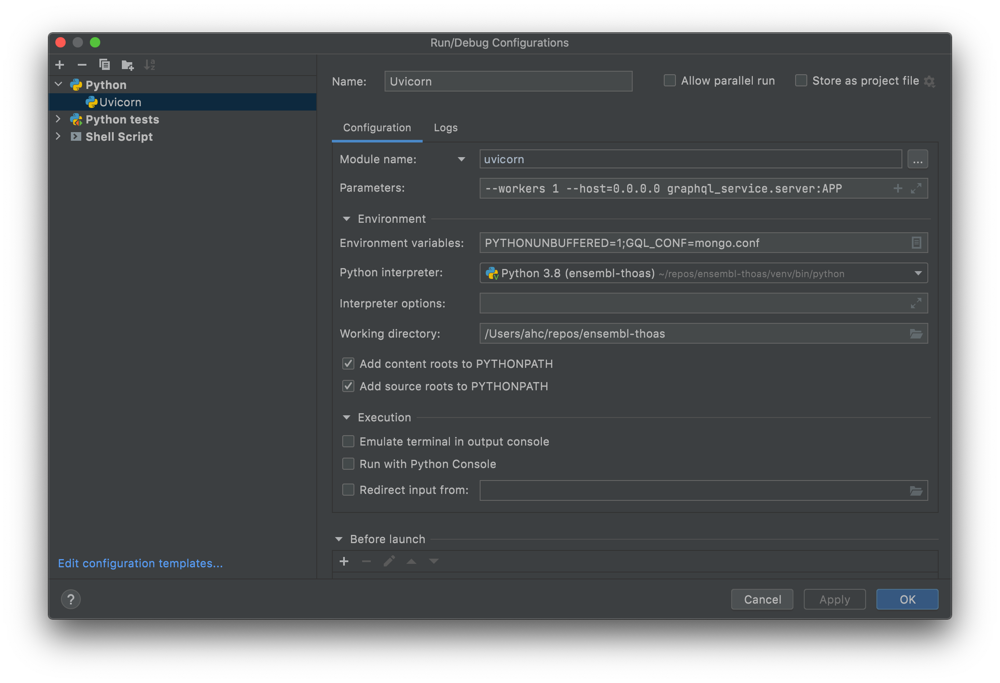
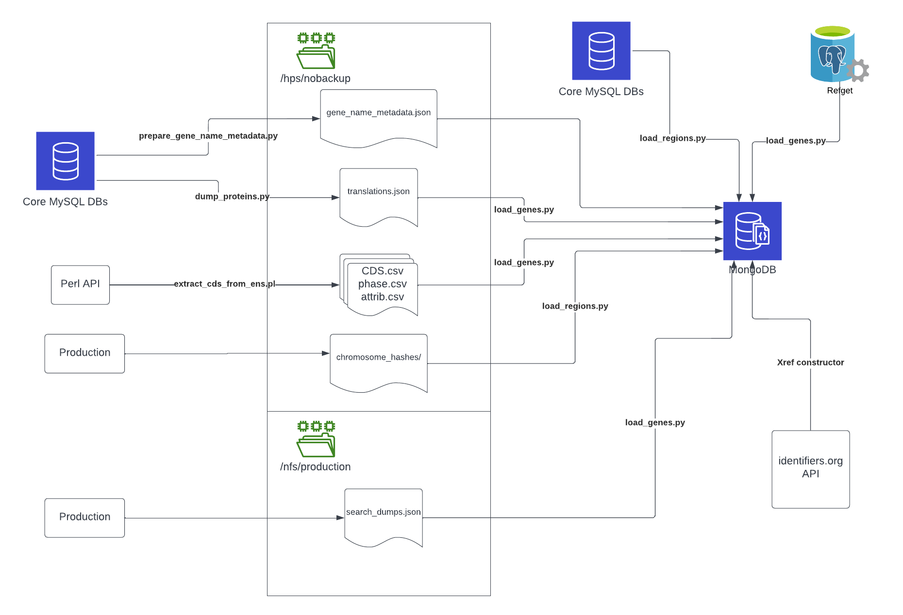

# GraphQL for Ensembl

A [GraphQL trial](https://graphql.org/) for [Ensembl](https://www.ensembl.org) to reduce the need for RESTful web services.

This application is implemented with [Ariadne](https://ariadnegraphql.org/), a schema-first graphql framework for Python

/scripts contains tooling for populating backend databases on Codon.

GraphQL requires a schema (in /common) and implementation of resolver functions that know how to interpret specific parts of a GraphQL query. Resolvers are found in /resolver, and may also make use of "data loaders" to overcome inherent deficiencies in GraphQL implementations.

https://www.ebi.ac.uk/seqdb/confluence/display/EA/Thoas+Docs

## Installation
Requires Python 3.7+.  

To install dependencies, run:

`pip install -r requirements-api.txt` for just the API.  Use this when deploying the service.

`pip install -r requirements-loading.txt` for just the data loading scripts.  Use this when running the loading scripts on Codon.

`pip install -r requirements-dev.txt` installs everything including dev dependencies like pytest, mypy etc.

## Running the API locally
Put configuration MongoDB configuration `./mongo.conf`

The file follows the following template:
```
[MONGO DB]
host = 
port = 
user = 
password = 
db = 
collection = 
```

This command will start the server:

```GQL_CONF=mongo.conf uvicorn --workers 1 --host=0.0.0.0 graphql_service.server:APP```


If you're developing in PyCharm, you will probably find it useful to create a run 
configuration so that you can use the debugger.  Create a run configuration that 
looks like this:



## Development

### Testing

Navigate to the root of this repository and set this environment variable:
```
export META_CLASSIFIER_PATH=$PWD/docs/metadata_classifiers/
```
Then to run all the tests run ```pytest .```

### Linting

From the root of the repository:

`pylint $(git ls-files '*.py') --fail-under=9.5`

### Type checking

At the moment we only enforce type-checking in the API code.  Run this command from the root of the repository:

`mypy graphql_service`

### Formatting

`black . --check --diff` previews the formatting.

`black .` applies the formatting in-place.

## Containerisation

Build the image using `./Dockerfile`:

`docker build -t $NAME:$VERSION .`

Run a container with the image (`--publish` below is exposing the container's ports to the host network):

`docker container run --publish 0.0.0.0:80:80/tcp --publish 0.0.0.0:8000:8000/tcp -ti $NAME:$VERSION`

There are two other Dockerfiles in this repo at `k8s/Dockerfile` and `web/Dockerfile`.  These Dockerfiles are intended 
to be used in Kubernetes, and for those the Mongo configuration is passed in a different way to the `./Dockerfile`.  In 
`./Dockerfile` the Mongo conf is assumed to exist in the repo as the file `./mongo.conf` and gets built into the Docker 
image.  For the other Dockerfiles the configuration is not in the image.  Instead it gets externalised as a variable pointing to 
a location where the config file has been mounted using a k8s object called a config-map.  If we want to emulate this 
in Docker then we could look into using Docker [bind mounts](https://docs.docker.com/storage/bind-mounts/).


## Data loading

Instructions for loading Thoas data are here: https://www.ebi.ac.uk/seqdb/confluence/display/EA/Data+loading+on+Codon

### Data loading architecture


