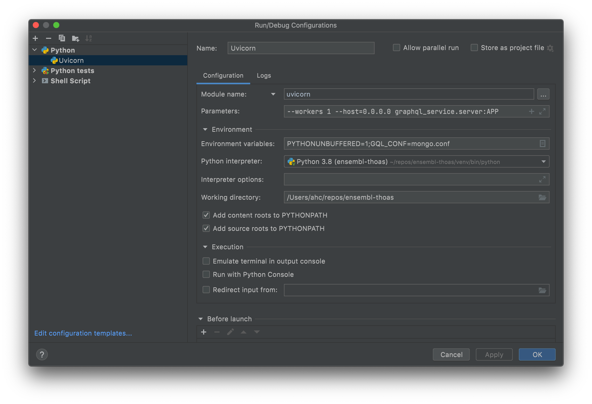

# GraphQL for Ensembl

A [GraphQL trial](https://graphql.org/) for [Ensembl](https://www.ensembl.org) to reduce the need for RESTful web services.

This application is implemented with [Ariadne](https://ariadnegraphql.org/), a schema-first graphql framework for Python

GraphQL requires a schema (in /common) and implementation of resolver functions that know how to interpret specific parts of a GraphQL query. Resolvers are found in /resolver, and may also make use of "data loaders" to overcome inherent deficiencies in GraphQL implementations.

https://www.ebi.ac.uk/seqdb/confluence/display/EA/Thoas+Docs

## Installation
Requires Python 3.10+.  

To install dependencies, run:

`pip install -r requirements.txt` for just the API.  Use this when deploying the service.

`pip install -r requirements-dev.txt` installs everything including dev dependencies like pytest, mypy etc.

## Running the API locally
Rename example_connections.conf to connections.conf and update the config values accordingly.

This command will start the server:
```
uvicorn --workers 1 --host=0.0.0.0 graphql_service.server:APP
```

To run a Uvicorn server with automatic reload for development purposes, you can use the --reload flag. This flag will make Uvicorn watch your code for changes and automatically restart the server when it detects any changes.
```
uvicorn --workers 1 --host 0.0.0.0 --reload graphql_service.server:APP
```
Also, if you're developing in PyCharm, you will probably find it useful to create a run 
configuration so that you can use the debugger.  Create a run configuration that 
looks like this:



## Genome-to-release mapping

Database routing checks Redis first (when `GRPC_ENABLE_CACHE` is enabled), then
`metadata.genome_mapping` on the configured MongoDB deployment. Documents are
matched by `genome_uuid`; the highest numeric `release_version` is selected
(for example, `110.10` takes precedence over `110.9`). The version is converted
to a database name such as `release_110_10`. An explicitly supplied release in
the synchronous routing API bypasses this lookup.

If there is no valid mapping, or the MongoDB mapping query fails, routing falls
back to the metadata gRPC service. Both lookup paths cache successful results
for `REDIS_EXPIRY_SECONDS`. A non-unique index on `genome_uuid` is recommended
for the mapping collection, and the MongoDB user needs read access to it.

`WARMUP_CACHE_ON_START` now reads this collection and caches the highest release
per genome with the same expiry. Mapping cache keys use `genome_mapping:<uuid>`
so legacy bare-UUID entries without expiry do not override the new mappings.
Mapping changes become visible after cache expiry or the next warm-up.
gRPC is still used for other metadata queries and initialized at startup.

## GraphiQL UI wiring
The in-browser GraphiQL UI is assembled from a custom HTML template plus static assets:

- `graphql_service/server.py` loads `graphql_service/templates/custom_graphiql.html` and injects a default query string.
- `graphql_service/templates/custom_graphiql.html` pulls in the GraphiQL CDN assets, then loads the local static files.
- `graphql_service/static/graphiql_examples.js` defines `window.GRAPHIQL_EXAMPLES` (used by the Examples sidebar).
- `graphql_service/static/graphiql_app.js` reads `window.__GRAPHIQL_CONFIG__` and mounts GraphiQL with the custom plugins.
- `graphql_service/static/graphiql_custom.css` provides the visual styling layer for the UI.

## Development

### Pre-commit hook (local)

To run Black, Pylint, and Mypy automatically before each commit, create `pre-commit` hook under `.git/hooks/`:

```
cat <<'EOF' > .git/hooks/pre-commit
#!/bin/sh
set -e

black . --check --verbose --diff --color
pylint $(git ls-files '*.py') --fail-under=9.5
mypy graphql_service
EOF
chmod +x .git/hooks/pre-commit
```

> Note: 
> * `.git/hooks` is not versioned, so each developer needs to run this once locally.
> * You can test it by running `.git/hooks/pre-commit`
> * If any of Black/pylint/mypy fails, the commit will be blocked.


### Testing

```
cd ensembl-thoas
pytest .
```

### Linting

From the root of the repository:

```
cd ensembl-thoas
pylint $(git ls-files '*.py') --fail-under=9.5
```

### Type checking

```
cd ensembl-thoas
mypy graphql_service
```

### Formatting

`black . --check --diff` previews the formatting.

`black .` applies the formatting in-place.

## Containerisation

Build the image using `./Dockerfile`:

`docker build -t $NAME:$VERSION .`

Run a container with the image (`--publish` below is exposing the container's ports to the host network):

`docker container run --publish 0.0.0.0:80:80/tcp --publish 0.0.0.0:8000:8000/tcp -ti $NAME:$VERSION`

The connection configuration is assumed to exist in the repo as the file `./connections.conf` and gets built into the Docker 
image. On Kubernetes cluster, these configs are passed through k8s objects called a escrets.  If we want to emulate this 
in Docker then we could look into using Docker [bind mounts](https://docs.docker.com/storage/bind-mounts/).
